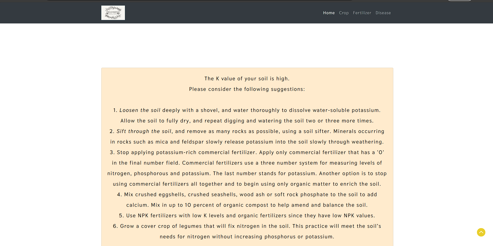

# FIELDMIND🌿

An innovative Machine Learning (ML) and Deep Learning (DL) powered web platform designed to revolutionize agricultural practices. Our platform offers a trifecta of cutting-edge applications tailored to enhance crop management and maximize yields: Crop Intelligence, Fertilizer Insights, and Plant Health Diagnosis.

## RATIONALE

- In this project, I present a website in which the following applications are implemented; Crop recommendation, Fertilizer recommendation and Plant disease prediction, respectively.
- - In the crop recommendation application, the user can provide the soil data from their side and, By analyzing key soil parameters alongside climatic conditions fetched through real-time Weather APIs, our system delivers tailored recommendations, enhancing agricultural decision-making processes.
  - For the fertilizer recommendation application, the user can input the soil data and the type of crop they are growing, Leveraging advanced ML techniques, our platform assesses soil composition, identifying deficiencies or excesses in crucial nutrients. Armed with this insight, personalized fertilizer recommendations are generated, ensuring optimal nutrient balance tailored to crop requirements.
  - For the last application, that is the plant disease prediction application, the user can input an image of a diseased plant leaf, and Powered by DL models trained on extensive datasets, our system accurately identifies diseases and offers comprehensive insights into their nature. Furthermore, users receive actionable recommendations for effective disease management, bolstered by informative background summaries.

# Built with 🛠️

<code></code>
<code></code>`
`<code></code>`
`<code>`</code>
`<code></code>`
`<code></code>`
`<code></code>`
`<code>``</code>

<code></code><code></code>`
`<code></code>`
`<code></code>`
`<code>``</code>

## How to run locally 🛠️

- Before the following steps make sure you have [git](https://git-scm.com/download), [Anaconda](https://www.anaconda.com/) or [miniconda](https://docs.conda.io/en/latest/miniconda.html) installed on your system
- Clone the complete project or you can just download the code and unzip it
- `deploy` branch has only the code required for deploying the app (rest of the code that was used for training the models, data preparation can be accessed on `master` branch)
- It is highly recommended to clone the deploy branch for running the project locally (the further steps apply only if you have the deploy branch cloned)
- Once the project is cloned or downloaded , open anaconda prompt in the directory where the project was cloned and paste the following block
  ```
  conda create -n fieldmind python=3.6.12
  conda activate fieldmind
  pip install -r requirements.txt
  ```
- And finally run the project with
  ```
  python app.py
  ```
- Open the localhost url provided after running `app.py` and now you can use the project locally in your web browser.

## DEMO

### HOME!!

### Crop recommendation system


### Fertilizer suggestion system


### Disease Detection system


# RESULT DEMO!!


